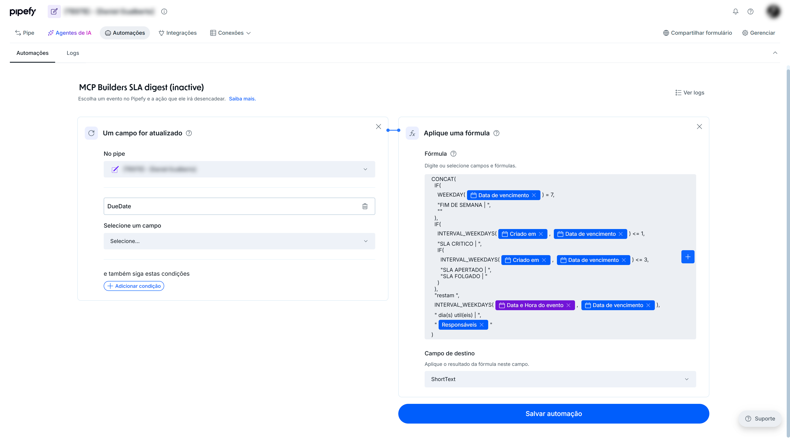

# Evidence

Keep this short. Four answers, half a page is plenty.

## The problem

Same-card math (SUM, IF, weekday, SLA digest) was being sent to iPaaS,
which adds minutes of delay, or guessed from `get_automation_event_attributes`.
That catalog currently exposes **one** official row:
`%{automation_event_execution_datetime}`. The native action that **runs**
the formula engine is **Aplique uma fórmula** (`run_a_formula`).
`update_card_field` only copies the string (tokens substitute; `IF`/`SUM`
are not evaluated).

## What the skill built

An **inactive** `run_a_formula` rule on a test pipe I control — the SLA
digest from the skill (nested `IF` + `WEEKDAY` + `INTERVAL_WEEKDAYS` +
`%{assignees}` + `%{automation_event_execution_datetime}`):

- Trigger: `field_updated` on DueDate (`triggerFieldIds`)
- Action: `run_a_formula` into Short Text
- `get_automation` round-trip: `active=false`, `action_id=run_a_formula`,
  formula preserved in `field_map.value`
- Official catalog still **one** row

A first attempt used `update_card_field` + a trivial `IF`/`SUM`. That was
the wrong action and a weak formula. It was deleted; this rule replaced it.

## Proof

Hosted MCP: `get_automation_actions` (confirm `run_a_formula`) →
`get_automation_event_attributes` (one row) → `create_automation`
`active=false` `action_id=run_a_formula` → `get_automation`.

Screenshot (blur pipe id and personal names; toggle **inactive**; action
must read **Aplique uma fórmula**, not Atualizar campo):

## What you had to fix

`update_card_field` does not apply formulas. `run_a_formula` rejects
`card_created` (`triggerEvents` are `field_updated` / `sla_based`).
`event_params.trigger_field_ids` (snake_case) is rejected; use
`triggerFieldIds`. The live proof is the skill's SLA digest, not a
one-line IF.
