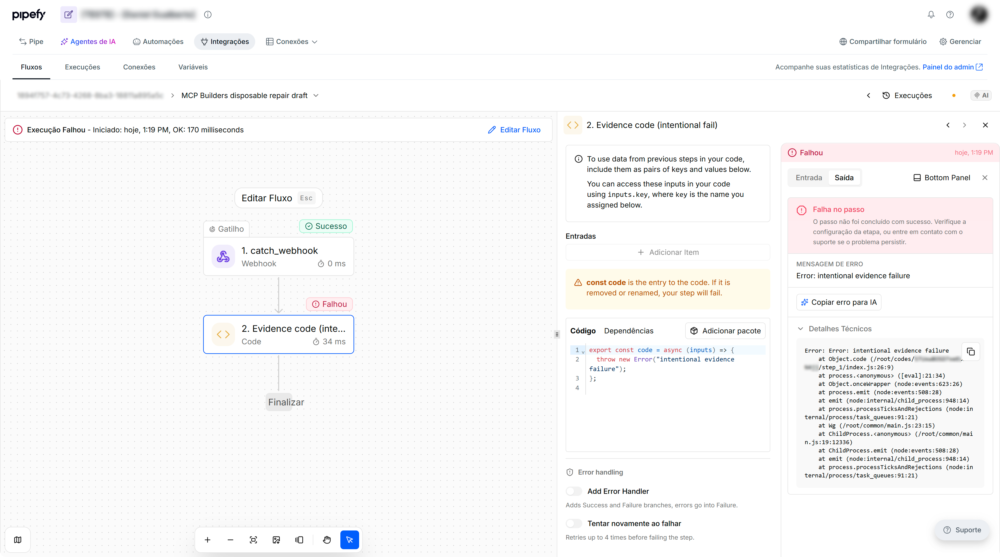
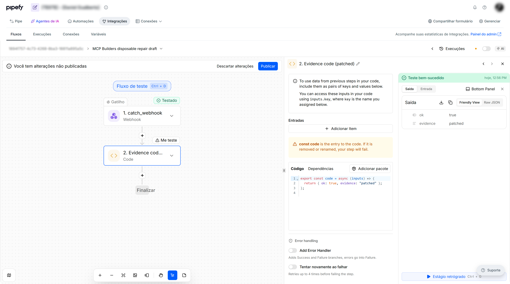

# Evidence

Keep this short. Four answers, half a page is plenty.

## The problem

A failed Advanced Automations run usually led to rebuilding the flow from
scratch. Repair needs a surgical read of the run, a patch on the failing
step, and validate-without-publish. Retry and publish stay behind explicit
user intent.

## What the skill built

Two layers on a test pipe I control.

**1. Playbook flow (do not mutate).** TESTING had a purged FAILED run
(`Failed at: Enviar solicitação HTTP`). PRODUCTION `status=FAILED` was
empty. Current structure no longer contains that HTTP piece. No patch.

**2. Disposable draft (explicitly authorized), photographed in stages.**
Created `MCP Builders disposable repair draft` (webhook + CODE). CODE
threw `intentional evidence failure`. Sample-data `ap_test_flow` →
FAILED. After the FAIL screenshot: surgical `ap_update_step` on
`step_1` only, `ap_validate_flow`, sample-data SUCCEEDED. The flow was
later **published then disabled** (enable/disable only — no Publish
button). Left **DISABLED**. Not re-enabled.

## Proof

Screenshots are taken **in order** (fail → patch canvas → success). Blur
ids and names.

Hosted MCP: `ap_get_run` → `ap_update_step` → `ap_validate_flow` →
`ap_test_flow` (sample data, not a live webhook).

## What you had to fix

PRODUCTION `status=FAILED` hid useful runs (TESTING). Purged playbook
runs still return flow id + failed-step label, but that label may be
absent from current structure. `ap_build_flow` dropped unknown webhook
properties (`liveMarkdown`); valid props are `authType` + `authFields`.
A passing `ap_test_flow` with mock data is sample data. The disposable
flow was published in the UI and then left **DISABLED** (no re-enable).
