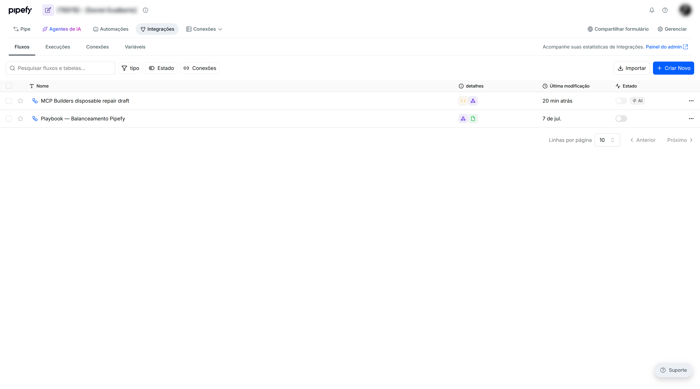
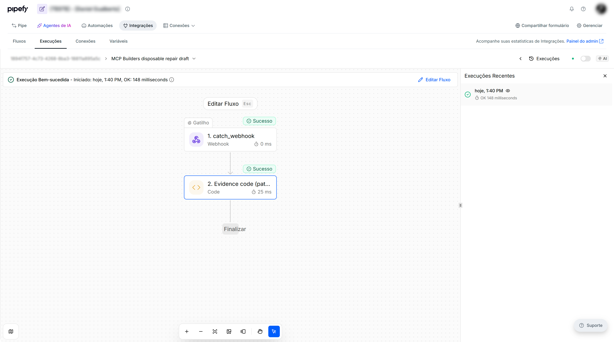

# Evidence

Keep this short. Four answers, half a page is plenty.

## The problem

CS and org admins could not see Advanced Automations (iPaaS) health at
organization scope. Native observability covers if/then jobs and AI credits.
iPaaS runs live in a per-pipe hosted catalog with no date filter, so people
either ignored the product or clicked one flow at a time. That briefing is a
recurring CS/admin task, not a one-off.

## What the skill built

A **read-only** org briefing (no retry, no publish). Membership-scoped
`list_organizations`, then two pipes I control:

- Pipe A: `get_ipaas_tools` reported iPaaS disabled. The skill stops the
  iPaaS section and still delivers native usage (credits / automations /
  agents). Sandbox org in this session: AI credit `limit: 0`, native
  automations and agents usage at 0.
- Pipe B: hosted catalog with **42** tools. `ap_list_flows` → **2**
  webhook flows, both `DISABLED` + `published` (playbook + disposable
  repair flow). Unfiltered PRODUCTION `ap_list_runs` → latest page of
  **SUCCEEDED** only. PRODUCTION `status=FAILED` → empty. TESTING
  `ap_list_runs` → mixed page including FAILED (HTTP on the playbook,
  CODE on the disposable draft) and a later SUCCEEDED after repair.
  Native `get_automation_execution_metrics` `period=TWENTY_FOUR_HOURS`
  → **0** runs — a different unit from the iPaaS host page.

## Proof

Hosted MCP (`https://mcp.pipefy.com/mcp`). Calls: `list_organizations`,
`get_ipaas_tools`, `call_ipaas_tool` (`ap_list_flows`, `ap_list_runs`
PRODUCTION / PRODUCTION FAILED / TESTING), `get_automation_execution_metrics`,
`get_ai_credit_usage`.

In the iPaaS UI the **Runs tab is published-version history**. A draft's
Runs tab stays empty; after publish (then disable) the same flow shows
runs. MCP `ap_list_runs` listed TESTING executions before the tab did.

## What you had to fix

The first `status=FAILED` call used default PRODUCTION and looked "healthy".
Failures lived in TESTING. The skill already said FAILED does not include
TIMEOUT; we also recorded the **environment split**. Membership listings
are wide — client and personal names stay out of this file and are blurred
in the screenshots.
